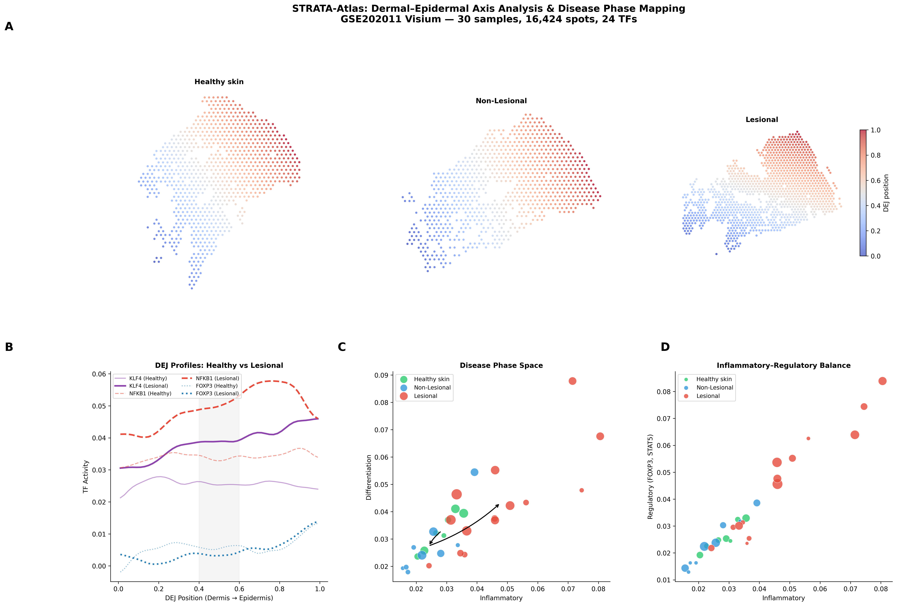

# STRATA: Spatial Transcription-factor Regulatory Architecture

[](https://doi.org/10.64898/2026.02.24.707661)
[](https://doi.org/10.5281/zenodo.18779419)
[](LICENSE)

STRATA treats regulon activity scores as **continuous scalar fields on tissue manifolds**, enabling gradient computation, divergence analysis, and field coupling quantification directly on spatial transcriptomics coordinates.

---

## Overview

Standard spatial transcriptomics tools focus on cell-type deconvolution and ligand??receptor inference. STRATA provides a complementary, **field-theoretic** perspective: it computes smooth regulon activity fields from discrete spot-level data, then applies differential operators (gradient, divergence, Laplacian) to quantify spatial architecture.

**Key capabilities:**
- Compute regulon activity fields on any spatial platform (Visium, MERFISH, Slide-seq, Xenium)
- Data-driven tissue axis definition (e.g., dermal??epidermal junction) without anatomical annotation
- 1D field profiles with bootstrap confidence intervals
- Sample-level phase diagrams for disease classification
- Field coupling analysis between regulatory programs

---

## Installation

```bash
# Clone
git clone https://github.com/jengweitjiu/STRATA.git
cd STRATA

# Dependencies
pip install numpy scipy pandas scanpy matplotlib decoupler-py omnipath
```

**Requirements:** Python ??3.9

---

## Quick Start

```python
import pandas as pd
import numpy as np
from scipy.ndimage import gaussian_filter1d

# Load STRATA fields (precomputed regulon activity)
tf_activity = pd.read_csv("tf_activity_spatial.csv", index_col=0)
metadata = pd.read_csv("metadata.csv", index_col=0)
coords = pd.read_csv("spatial_coords.csv", index_col=0)

# Define DEJ axis from regulon fields
epi_tfs = ["KLF4", "SOX9", "TP53", "MYC"]
der_tfs = ["SMAD3", "FOXP3", "SPI1", "IRF1"]

epi_score = tf_activity[epi_tfs].mean(axis=1)
der_score = tf_activity[der_tfs].mean(axis=1)

# Weighted centroids ??axis direction ??project spots
epi_mask = epi_score > epi_score.median()
der_mask = der_score > der_score.median()
epi_centroid = coords.loc[epi_mask, ["imagerow", "imagecol"]].mean()
der_centroid = coords.loc[der_mask, ["imagerow", "imagecol"]].mean()

axis_vec = (epi_centroid - der_centroid).values
axis_vec /= np.linalg.norm(axis_vec)

# Project and normalize to [0, 1]
positions = coords[["imagerow", "imagecol"]].values @ axis_vec
dej_position = (positions - positions.min()) / (positions.max() - positions.min())
```

---

## Atlas Validation: Psoriasis (GSE202011)

We validated STRATA on 30 skin biopsies (16,424 Visium spots) from healthy, non-lesional, and lesional psoriasis tissue.

### Key Results

| Finding | Value | Significance |
|---------|-------|-------------|
| Inflammatory??Regulatory coupling | ? = 0.94, R² = 0.95 | P = 1.7 ? 10??¹⁹ |
| Coupling slope | 1.06 | Near-perfect 1:1 scaling |
| Regulatory residual vs PASI | ? = 0.47 | P = 0.023 |
| Raw inflammatory vs PASI | ? = 0.04 | P = 0.86 (n.s.) |
| KLF4 bins significant (H vs L) | 34/50 | Bonferroni-corrected |
| FOXP3 bins significant (H vs L) | **0/50** | No spatial difference |
| MYC bins significant | 45/50 | Bonferroni-corrected |
| STAT3 bins significant | 46/50 | Bonferroni-corrected |

**Key insight:** The regulatory arm scales 1:1 with inflammation ("coupled but overwhelmed"). The *imbalance* between regulatory and inflammatory fields ??not absolute inflammation ??predicts clinical severity (PASI). This finding is invisible to standard differential expression.

### Main Figure



**(a)** DEJ axis on tissue coordinates. **(b)** 1D regulon field profiles with 95% bootstrap CIs. **(c)** Inflammatory??regulatory coupling (R² = 0.95) and disease phase space. **(d)** Regulatory residual predicts PASI (? = 0.47).

---

## Repository Structure

```
STRATA/
?????? README.md
?????? LICENSE
?????? figures/
??  ?????? Fig_COMPOSITE_v3_reordered.png
?????? (analysis scripts in Zenodo archive)
```

Full data, scripts, and figures: [Zenodo archive](https://doi.org/10.5281/zenodo.18779419)

---

## Data Availability

| Dataset | Source | Use |
|---------|--------|-----|
| GSE173706 | Reynolds et al., Science 2021 | scRNA-seq (83,352 cells) |
| GSE202011 | Castillo et al., Sci. Immunol. 2023 | Spatial transcriptomics (16,424 spots) |

---

## Related Work

- **SICAI** ??Stromal-Immune Coupled Attractor Index for psoriasis ([Zenodo](https://doi.org/10.5281/zenodo.18667362))

---

## Citation

```bibtex
@article{tjiu2026strata,
  title={STRATA: Spatial Transcription-factor Regulatory Architecture for tissue field analysis},
  author={Tjiu, Jeng-Wei},
  journal={bioRxiv},
  year={2026},
  doi={10.64898/2026.02.24.707661}
}
```

---

## License

MIT License. See [LICENSE](LICENSE).
